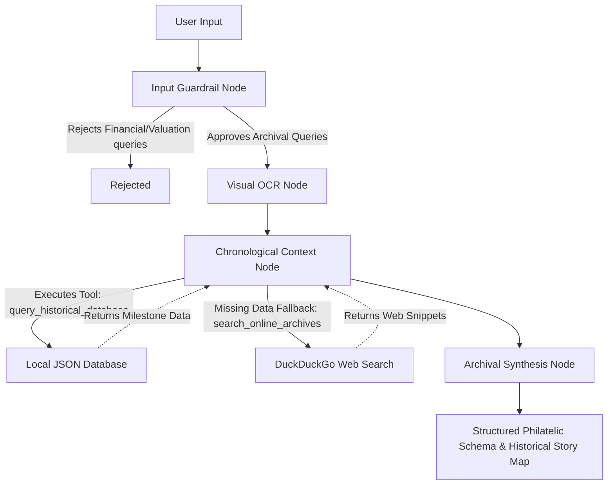

# 🏛️ Philatelic Archivist

Philatelic Archivist is an advanced, multi-agent AI system built on the Google Agent Development Kit (ADK) 2.0. It automatically evaluates, classifies, and synthesizes historical narratives for rare philatelic items (postage stamps, cancellations, and First Day Covers) using a robust LLM-driven graph workflow and a hybrid deterministic local database.

---

## 🌐 Live Public Demo

Try the live version of Philatelic Archivist deployed securely on Hugging Face Spaces Docker:
👉 **[Launch Philatelic Archivist Demo](https://ghoshitaghosh-philatelic-archivist.hf.space/)**

*(Note: The demo uses our Bring Your Own Key architecture. You will need your own Gemini API key to interact with the agent, guaranteeing zero quota leakage.)*

**How to get a free API Key:**
1. Go to [Google AI Studio](https://aistudio.google.com/app/apikey).
2. Sign in with your Google account.
3. Click **Create API Key** to generate a free key instantly.
4. Paste the key into the Philatelic Archivist demo!

---

## 🏗️ Architecture Diagram

The backend workflow is modeled as a stateful graph powered by the Google ADK 2.0. The graph routes incoming archival requests through a strict sequence of validation, extraction, database querying, and final synthesis.



## ✨ Engineering Highlights

Throughout the development of this capstone project, several complex engineering challenges were resolved to ensure enterprise-grade stability and free-tier compatibility:

### 1. Handling NDJSON Stream Fragmentation
When streaming real-time thought processes from the ADK backend to the frontend, large JSON objects were occasionally chunked mid-stream by FastAPI, leading to fragmented `JSON.parse()` errors on the client side. 
**Solution:** We engineered a robust chunk buffering system in `frontend/index.html` that concatenates incoming byte streams and safely extracts completely formed NDJSON boundaries before attempting to parse, guaranteeing flawless live-rendering of the Agent's internal cognition.

### 2. Defensive Token & Quota Management
Evaluating complex multi-agent graphs locally can rapidly drain the Gemini Free Tier burst rate limits (RPM), resulting in persistent `429 RESOURCE_EXHAUSTED` errors during automated `agents-cli eval` executions.
**Solution:** 
- We developed a custom evaluation runner (`tests/eval/run_local_eval.py`) that strictly bypasses GCP ADC assumptions and injects deterministic sleep-delays between test cases to allow burst-quota buckets to refill. 
- We dynamically downgraded internal graph nodes from standard experimental endpoints to high-quota lite variants (e.g., `gemini-3.1-flash-lite`) to guarantee maximum uptime across extensive evaluation suites.

### 3. Native Multimodal Vision & Streaming Integrity
Unlike typical text-only chatbots, this project leverages Gemini's native multimodality to process raw image data. The frontend UI seamlessly encodes user-uploaded artifacts (like vintage stamps) into Base64 streams, routing them securely through FastAPI into the ADK graph. The `visual_ocr_node` physically "sees" the artifact to extract faint cachet watermarks and postmark dates without relying on external OCR libraries. 

* **Live Model Swapping:** A dynamic frontend selector allows users to instantly pivot between models (e.g., `gemini-3.1-flash-lite`, `gemini-3.5-flash`) at runtime. The FastAPI backend hot-swaps the underlying LLM agents across the entire ADK graph before executing the request.
* **Streaming Integrity Defense:** To maintain the integrity of the NDJSON live stream, the backend automatically intercepts and strips raw binary image buffers from the ADK diagnostic event stream before JSON serialization. This prevents `TypeError` serialization crashes while still allowing the LLM to process the images natively.

### 4. Bring Your Own Key (BYOK) Architecture for Public Deployments
To allow for safe public deployments (e.g., on Hugging Face Spaces) without leaking developer API quotas, the frontend features a dynamic configuration probe. If the backend is running without a local `.env` file, the UI dynamically surfaces a secure `<input type="password">` field for visitors to supply their own Gemini API key. 
**Secure Execution Isolation:** The visitor's key is passed exclusively via a custom HTTP header (`X-Gemini-Key`). The FastAPI backend employs a strict `asyncio.Lock()` to prevent cross-contamination between concurrent users, temporarily injecting the key into the local process and forcefully wiping it via an ironclad `finally` block the precise microsecond the graph execution concludes.

### 5. Iterative Parallel Web Scraper Orchestration
Because Native Google Search Grounding limits strict free-tier API keys to 0 requests without a billing account, we architected a resilient, 100% free fallback. Rather than deploying a costly "Browsing Agent Swarm" or a generic single-query scraper, we engineered a pure-Python, dependency-free DuckDuckGo parallel scraper (`search_online_archives`). To prevent "masking" (where a popular historical event shadows an obscure stamp), the LLM context node generates an array of highly-specific search variations. The backend dispatches these searches concurrently via `asyncio.gather()` and cross-references the historical snippets in a single LLM pass, ensuring flawless disambiguation without inflating token quotas.

### 6. Resilient NDJSON Error Streaming & Serialization
In multi-agent sequential architectures, rate limits (like the Gemini 15 Requests Per Minute Free Tier quota) are easily triggered, typically resulting in fatal ASGI server crashes (`429 RESOURCE_EXHAUSTED`). We engineered a secure `try/except` wrapper around the ADK `InMemoryRunner` event loop that gracefully intercepts all underlying SDK and quota exceptions, serializing them into robust NDJSON error chunks. Furthermore, the streaming payload is deeply sanitized via a recursive function to explicitly strip un-serializable ADK context state (such as raw Pydantic multimodal image bytes), entirely preventing `TypeError` JSON crashes. This ensures the frontend elegantly renders clear, actionable error messages directly into the UI stream without ever dropping the connection.

### 7. Multimodal Context Restoration
Sequential ADK LLMAgents typically suffer from the "telephone game" flaw: downstream nodes only receive the text schema output of upstream nodes, completely losing visual access to the original multimodal image. We resolved this by configuring the initial Input Guardrail to securely cache the original binary payload in the global ADK memory (`ctx.state`). A dedicated `prepare_context_node` subsequently retrieves this image payload and stitches it to the OCR text, restoring full multimodal vision for the Chronological Context Node.

### 8. Zero-Blocking In-Memory DB Cache
To prevent even micro-second event loop stalling inside the ASGI server, the local `historical_registry.json` database is cached directly into Python server RAM upon the first execution. This ensures all deterministic milestone queries operate at purely CPU-bound speeds with zero blocking disk I/O.

---

## 🚀 Step-by-Step Reproduction

Follow these steps to deploy and run the Philatelic Archivist locally.

### 1. Clone the Repository
```bash
git clone https://github.com/yourusername/philatelic-archivist.git
cd philatelic-archivist
```

### 2. Environment Setup

**Option A: Gemini Developer API Key (Default)**
Create a `.env` file in the root directory and add your Google Gemini API key:
```env
GEMINI_API_KEY="your-api-key-here"
```

**Option B: Google Cloud Project (Vertex AI)**
If you are deploying in an enterprise environment or prefer using Google Cloud Vertex AI, you can bypass the API key by providing your Google Cloud Project details and using Application Default Credentials (ADC).
1. Authenticate your local machine: `gcloud auth application-default login`
2. Configure your `.env` file:
```env
GOOGLE_CLOUD_PROJECT="your-gcp-project-id"
GOOGLE_CLOUD_LOCATION="us-central1"
```

**Option C: Public Demo Mode (Bring Your Own Key)**
To deploy safely on public platforms (e.g. Hugging Face Spaces Docker), simply omit the `.env` file entirely. The frontend will dynamically detect the naked server and render a secure input field requiring visitors to supply their own API keys, completely protecting your personal quotas.

### 3. Install Dependencies
This project uses [uv](https://github.com/astral-sh/uv) for lightning-fast Python dependency management.
```bash
uv sync
```

### 4. Run the Server
Launch the backend FastAPI server which hosts the ADK 2.0 Workflow:
```bash
uv run python app/server.py
```

### 5. Access the Frontend
Open `http://localhost:8000/` in any modern web browser. The FastAPI server natively mounts and serves the frontend application. 
Type an archival request (e.g., *"Analyze the 1950 First Day Cover commemorating the Republic of India with a faint cancellation mark from Calcutta GPO dated 26 Jan 1950"*) and watch the Archival Passport synthesize the historical registry live!

### 6. Run the Evaluation Suite (Optional)
To verify the structural integrity of the graph and test the guardrail limits without hitting API rate limits, run the custom local evaluation script:
```bash
uv run python tests/eval/run_local_eval.py
```
